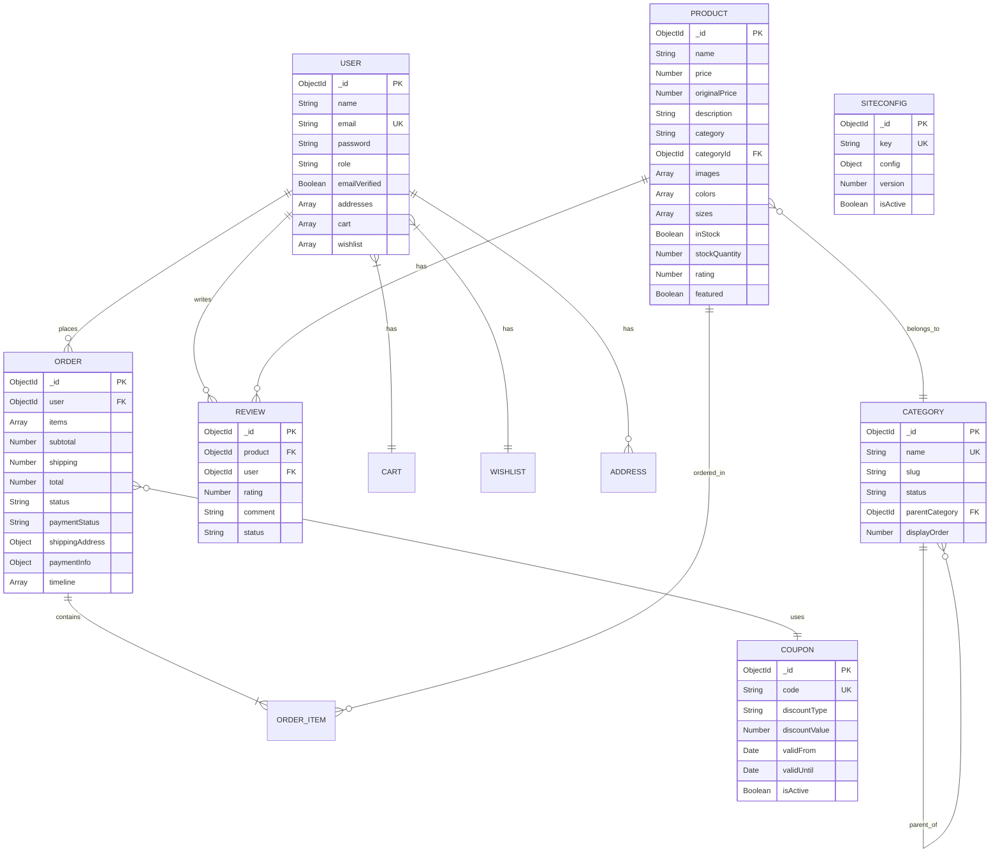

# 🛒 E-Commerce Platform - Knowledge Transfer Document

> **Last Updated:** December 21, 2025  
> **Platform:** Full-Stack E-Commerce Monorepo  
> **Tech Stack:** React 19 + TypeScript + Vite | Express.js | MongoDB | Tailwind CSS

---

## Table of Contents

1. [Quick-Start Guide](#1-quick-start-guide)
2. [System Architecture](#2-system-architecture)
3. [Backend Reference](#3-backend-reference)
4. [Frontend Reference](#4-frontend-reference)
5. [Admin Dashboard Reference](#5-admin-dashboard-reference)
6. [Key Business Flows](#6-key-business-flows)
7. [Database Schema](#7-database-schema)
8. [API Endpoint Catalog](#8-api-endpoint-catalog)
9. [Operations & Maintenance](#9-operations--maintenance)
10. [Cross-Reference Index](#10-cross-reference-index)

---

## 1. Quick-Start Guide

### 🚀 5-Minute Setup

**Prerequisites:**
- Node.js v18+
- MongoDB running on port `28000`
- npm or yarn

**Step 1: Clone & Install Dependencies**
```bash
# Install all services
cd backend && npm install
cd ../frontend && npm install
cd ../adminfrontend && npm install
```

**Step 2: Configure Environment**
- Copy [backend/config.env](backend/config.env) and set your values
- Required: `DATABASE`, `JWT_SECRET`, `EMAIL_*` credentials

**Step 3: Seed Database**
```bash
cd backend
npm run seed           # Products
npm run seed:config    # Site configuration
node scripts/createAdmin.js  # Admin user
```

**Step 4: Start All Services**
```powershell
.\start-workspace.ps1
```
Or manually start each service with `npm run dev` in separate terminals.

### 📡 Service Port Reference

| Service | Port | URL | Purpose |
|---------|------|-----|---------|
| **Backend API** | 5001 | http://localhost:5001 | REST API server |
| **Frontend Store** | 5177 | http://localhost:5177 | Customer storefront |
| **Admin Dashboard** | 8091 | http://localhost:8091 | Admin management panel |
| **MongoDB** | 28000 | mongodb://localhost:28000 | Database |

### 🔧 Essential Commands

| Task | Command | Location |
|------|---------|----------|
| Start all services | `.\start-workspace.ps1` | Root |
| Start backend only | `npm run dev` | backend/ |
| Start frontend only | `npm run dev` | frontend/ |
| Start admin panel | `npm run dev` | adminfrontend/ |
| Seed products | `npm run seed` | backend/ |
| Seed site config | `npm run seed:config` | backend/ |
| Create admin user | `node scripts/createAdmin.js` | backend/ |
| Run E2E tests | `npx playwright test` | frontend/ |

### 🏗️ Architecture at a Glance


---

## 2. System Architecture

### 2.1 High-Level Service Topology


### 2.2 Request Flow (User → Database)


### 2.3 Customer vs Admin Path Separation


### 2.4 Directory Structure Overview

```
ecommerce/
├── backend/                    # Express REST API
│   ├── server.js              # Entry point
│   ├── config.env             # Environment variables
│   ├── scripts/               # Database seeding & utilities
│   └── src/
│       ├── config/            # Database configuration
│       ├── controllers/       # Request handlers (22 files)
│       ├── middleware/        # Auth, rate limiting (5 files)
│       ├── models/            # Mongoose schemas (10 files)
│       ├── routes/            # API routes (20 files)
│       ├── services/          # Business logic
│       └── utils/             # Helpers (email, errors)
│
├── frontend/                   # Customer storefront
│   ├── src/
│   │   ├── components/        # UI components (24 files)
│   │   ├── pages/             # Page components (15 files)
│   │   ├── services/          # API services (8 files)
│   │   ├── hooks/             # Custom React hooks
│   │   └── types/             # TypeScript definitions
│   └── tests/                 # Playwright E2E tests
│
├── adminfrontend/              # Admin dashboard
│   └── src/
│       ├── pages/             # Admin pages (10 files)
│       ├── components/        # Dashboard, config UI
│       └── services/          # Admin API services
│
├── images/                     # Uploaded images storage
└── start-workspace.ps1         # Multi-service startup script
```

---

## 3. Backend Reference

### 3.1 Models (10 total)

| Model | File | Domain | Purpose |
|-------|------|--------|---------|
| **User** | [User.js](backend/src/models/User.js) | Auth | User accounts, cart, wishlist, addresses |
| **Product** | [Product.js](backend/src/models/Product.js) | Catalog | Product catalog with variants, inventory |
| **Category** | [Category.js](backend/src/models/Category.js) | Catalog | Hierarchical product categories |
| **Order** | [Order.js](backend/src/models/Order.js) | Orders | Orders with items, payment, shipping |
| **Coupon** | [Coupon.js](backend/src/models/Coupon.js) | Orders | Discount codes and usage tracking |
| **Review** | [Review.js](backend/src/models/Review.js) | Catalog | Product reviews and ratings |
| **SiteConfig** | [SiteConfig.js](backend/src/models/SiteConfig.js) | Config | Dynamic site configuration |
| **PaymentSettings** | [PaymentSettings.js](backend/src/models/PaymentSettings.js) | Config | Payment gateway settings |
| **ContactInquiry** | [ContactInquiry.js](backend/src/models/ContactInquiry.js) | Support | Contact form submissions |
| **Analytics** | [Analytics.js](backend/src/models/Analytics.js) | Admin | Business analytics events |

### 3.2 Controllers (22 total)

#### Authentication & Users
| Controller | File | Purpose |
|------------|------|---------|
| **authController** | [authController.js](backend/src/controllers/authController.js) | Login, signup, OTP, password reset |
| **userController** | [userController.js](backend/src/controllers/userController.js) | Profile management |
| **addressController** | [addressController.js](backend/src/controllers/addressController.js) | User address CRUD |
| **customerController** | [customerController.js](backend/src/controllers/customerController.js) | Admin customer management |

#### Products & Catalog
| Controller | File | Purpose |
|------------|------|---------|
| **productController** | [productController.js](backend/src/controllers/productController.js) | Product CRUD, search, filtering |
| **categoryController** | [categoryController.js](backend/src/controllers/categoryController.js) | Category CRUD operations |
| **reviewController** | [reviewController.js](backend/src/controllers/reviewController.js) | Product reviews management |
| **imageController** | [imageController.js](backend/src/controllers/imageController.js) | Image upload and retrieval |

#### Cart & Wishlist
| Controller | File | Purpose |
|------------|------|---------|
| **cartController** | [cartController.js](backend/src/controllers/cartController.js) | Shopping cart operations |
| **wishlistController** | [wishlistController.js](backend/src/controllers/wishlistController.js) | Wishlist management |

#### Orders & Payments
| Controller | File | Purpose |
|------------|------|---------|
| **orderController** | [orderController.js](backend/src/controllers/orderController.js) | Customer order operations |
| **adminOrderController** | [adminOrderController.js](backend/src/controllers/adminOrderController.js) | Admin order management, refunds |
| **paymentController** | [paymentController.js](backend/src/controllers/paymentController.js) | Razorpay payment processing |
| **paymentSettingsController** | [paymentSettingsController.js](backend/src/controllers/paymentSettingsController.js) | Payment config management |
| **couponController** | [couponController.js](backend/src/controllers/couponController.js) | Coupon CRUD and validation |

#### Admin & Configuration
| Controller | File | Purpose |
|------------|------|---------|
| **siteConfigController** | [siteConfigController.js](backend/src/controllers/siteConfigController.js) | Site configuration CRUD |
| **analyticsController** | [analyticsController.js](backend/src/controllers/analyticsController.js) | Dashboard analytics data |
| **bulkEmailController** | [bulkEmailController.js](backend/src/controllers/bulkEmailController.js) | Bulk email campaigns |
| **exportController** | [exportController.js](backend/src/controllers/exportController.js) | Data export functionality |

#### Support & Utilities
| Controller | File | Purpose |
|------------|------|---------|
| **contactController** | [contactController.js](backend/src/controllers/contactController.js) | Contact form submissions |
| **dbController** | [dbController.js](backend/src/controllers/dbController.js) | Database health checks |
| **errorController** | [errorController.js](backend/src/controllers/errorController.js) | Global error handling |

### 3.3 Routes (20 total)

| Route File | Base Path | Auth | Domain |
|------------|-----------|------|--------|
| [authRoutes.js](backend/src/routes/authRoutes.js) | `/api/auth` | Public/Protected | Authentication |
| [userRoutes.js](backend/src/routes/userRoutes.js) | `/api/users` | Protected | User profile |
| [addressRoutes.js](backend/src/routes/addressRoutes.js) | `/api/addresses` | Protected | Addresses |
| [productRoutes.js](backend/src/routes/productRoutes.js) | `/api/products` | Public/Admin | Products |
| [categoryRoutes.js](backend/src/routes/categoryRoutes.js) | `/api/categories` | Public/Admin | Categories |
| [cartRoutes.js](backend/src/routes/cartRoutes.js) | `/api/cart` | Protected | Cart |
| [wishlistRoutes.js](backend/src/routes/wishlistRoutes.js) | `/api/wishlist` | Protected | Wishlist |
| [orderRoutes.js](backend/src/routes/orderRoutes.js) | `/api/orders` | Protected | Customer orders |
| [adminOrderRoutes.js](backend/src/routes/adminOrderRoutes.js) | `/api/admin/orders` | Admin | Order management |
| [couponRoutes.js](backend/src/routes/couponRoutes.js) | `/api/coupons` | Public/Admin | Coupons |
| [reviewRoutes.js](backend/src/routes/reviewRoutes.js) | `/api/reviews` | Public/Protected | Reviews |
| [paymentRoutes.js](backend/src/routes/paymentRoutes.js) | `/api/payments` | Protected | Payments |
| [paymentSettingsRoutes.js](backend/src/routes/paymentSettingsRoutes.js) | `/api/payment-settings` | Admin | Payment config |
| [siteConfigRoutes.js](backend/src/routes/siteConfigRoutes.js) | `/api/site-config` | Public/Admin | Site config |
| [imageRoutes.js](backend/src/routes/imageRoutes.js) | `/api/images` | Public/Admin | Images |
| [analyticsRoutes.js](backend/src/routes/analyticsRoutes.js) | `/api/analytics` | Admin | Analytics |
| [customerRoutes.js](backend/src/routes/customerRoutes.js) | `/api/customers` | Admin | Customers |
| [bulkEmailRoutes.js](backend/src/routes/bulkEmailRoutes.js) | `/api/bulk-email` | Admin | Email campaigns |
| [contactRoutes.js](backend/src/routes/contactRoutes.js) | `/api/contact` | Public | Contact form |
| [exportRoutes.js](backend/src/routes/exportRoutes.js) | `/api/export` | Admin | Data export |

### 3.4 Middleware (5 files)

| Middleware | File | Purpose |
|------------|------|---------|
| **auth** | [auth.js](backend/src/middleware/auth.js) | JWT validation, `protect`, `restrictTo` |
| **rateLimiter** | [rateLimiter.js](backend/src/middleware/rateLimiter.js) | Rate limiting (API, auth, orders) |
| **validator** | [validator.js](backend/src/middleware/validator.js) | Input validation |
| **errorHandler** | [errorHandler.js](backend/src/middleware/errorHandler.js) | Error handling middleware |
| **notFound** | [notFound.js](backend/src/middleware/notFound.js) | 404 route handler |

---

## 4. Frontend Reference

### 4.1 Components by User Journey

#### Landing & Navigation (7 components)
| Component | File | Purpose |
|-----------|------|---------|
| **Navbar** | [Navbar.tsx](frontend/src/components/Navbar.tsx) | Main navigation, search, cart icon, user menu |
| **AnnouncementBar** | [AnnouncementBar.tsx](frontend/src/components/AnnouncementBar.tsx) | Top promotional banner with scrolling text |
| **HeroCarousel** | [HeroCarousel.tsx](frontend/src/components/HeroCarousel.tsx) | Homepage hero slider with dynamic content |
| **HotDealsSection** | [HotDealsSection.tsx](frontend/src/components/HotDealsSection.tsx) | Featured deals product grid |
| **TwoBoxSection** | [TwoBoxSection.tsx](frontend/src/components/TwoBoxSection.tsx) | Featured collections display |
| **FeatureSection** | [FeatureSection.tsx](frontend/src/components/FeatureSection.tsx) | Feature highlight section |
| **Footer** | [Footer.tsx](frontend/src/components/Footer.tsx) | Site footer with links, newsletter, social |

#### Product Browsing (4 components)
| Component | File | Purpose |
|-----------|------|---------|
| **ProductListingPage** | [ProductListingPage.tsx](frontend/src/components/ProductListingPage.tsx) | Product catalog with filters, sorting, pagination |
| **ProductDetailPage** | [ProductDetailPage.tsx](frontend/src/components/ProductDetailPage.tsx) | Individual product view with variants |
| **SearchSidebar** | [SearchSidebar.tsx](frontend/src/components/SearchSidebar.tsx) | Product search interface |
| **TestimonialSection** | [TestimonialSection.tsx](frontend/src/components/TestimonialSection.tsx) | Customer reviews carousel |

#### Authentication (5 components)
| Component | File | Purpose |
|-----------|------|---------|
| **LoginModal** | [LoginModal.tsx](frontend/src/components/LoginModal.tsx) | User login modal with OTP |
| **RegisterModal** | [RegisterModal.tsx](frontend/src/components/RegisterModal.tsx) | User registration with OTP verification |
| **WelcomePopup** | [WelcomePopup.tsx](frontend/src/components/WelcomePopup.tsx) | Post-login welcome message |
| **LogoutConfirmation** | [LogoutConfirmation.tsx](frontend/src/components/LogoutConfirmation.tsx) | Logout confirmation dialog |
| **Toast** | [Toast.tsx](frontend/src/components/Toast.tsx) | Toast notification component |

#### Account & Orders (3 components)
| Component | File | Purpose |
|-----------|------|---------|
| **AccountPage** | [AccountPage.tsx](frontend/src/components/AccountPage.tsx) | User profile, orders, addresses, wishlist tabs |
| **OrderTracking** | [OrderTracking.tsx](frontend/src/components/OrderTracking.tsx) | Order status tracking |
| **OrderDetails** | [OrderDetails.tsx](frontend/src/components/OrderDetails.tsx) | Order detail view |

#### Content Pages (4 components)
| Component | File | Purpose |
|-----------|------|---------|
| **AboutUs** | [AboutUs.tsx](frontend/src/components/AboutUs.tsx) | About page content |
| **ContactUs** | [ContactUs.tsx](frontend/src/components/ContactUs.tsx) | Contact information and form |
| **FAQPage** | [FAQPage.tsx](frontend/src/components/FAQPage.tsx) | Frequently asked questions |
| **ServiceFeaturesSection** | [ServiceFeaturesSection.tsx](frontend/src/components/ServiceFeaturesSection.tsx) | Service features icons/text |

### 4.2 Pages (15 total)

| Page | File | Route | Purpose |
|------|------|-------|---------|
| **Home** | [BillingPage.tsx](frontend/src/pages/BillingPage.tsx) | `/`, `/home` | Landing page |
| **Shop** | — | `/shop`, `/shop/:category` | Product catalog |
| **Product Detail** | — | `/product/:id` | Product details |
| **Cart** | [CartPage.jsx](frontend/src/pages/CartPage.jsx) | `/cart` | Shopping cart |
| **Checkout** | [CheckoutPage.tsx](frontend/src/pages/CheckoutPage.tsx) | `/checkout` | Checkout process |
| **UPI Payment** | [UPIPaymentPage.tsx](frontend/src/pages/UPIPaymentPage.tsx) | `/upi-payment` | Manual UPI payment |
| **Order Confirmation** | [OrderConfirmationPage.tsx](frontend/src/pages/OrderConfirmationPage.tsx) | `/order-success` | Order success |
| **Wishlist** | [WishlistPage.jsx](frontend/src/pages/WishlistPage.jsx) | `/wishlist` | User's saved items |
| **Policies** | [PoliciesPage.tsx](frontend/src/pages/PoliciesPage.tsx) | `/policies` | Policy pages |
| **Privacy Policy** | [PrivacyPolicyPage.tsx](frontend/src/pages/PrivacyPolicyPage.tsx) | `/privacy-policy` | Privacy policy |
| **Refund Policy** | [RefundPolicyPage.tsx](frontend/src/pages/RefundPolicyPage.tsx) | `/refund-policy` | Refund policy |
| **Terms** | [TermsConditionsPage.tsx](frontend/src/pages/TermsConditionsPage.tsx) | `/terms-conditions` | Terms and conditions |
| **Reset Password** | [ResetPasswordPage.tsx](frontend/src/pages/ResetPasswordPage.tsx) | `/reset-password/:token` | Password reset |
| **Logout** | [LogoutPage.jsx](frontend/src/pages/LogoutPage.jsx) | `/logout` | Logout handler |
| **Not Found** | [NotFoundPage.tsx](frontend/src/pages/NotFoundPage.tsx) | `*` | 404 page |

### 4.3 Services (8 files)

| Service | File | Purpose |
|---------|------|---------|
| **authService** | [authService.js](frontend/src/services/authService.js) | Login, signup, OTP, password reset |
| **cartService** | [cartService.js](frontend/src/services/cartService.js) | Shopping cart operations |
| **wishlistService** | [wishlistService.js](frontend/src/services/wishlistService.js) | Wishlist management |
| **orderService** | [orderService.js](frontend/src/services/orderService.js) | Order operations |
| **dataService** | [dataService.ts](frontend/src/services/dataService.ts) | Product and category data |
| **siteConfigService** | [siteConfigService.js](frontend/src/services/siteConfigService.js) | Site configuration fetching |
| **addressService** | [addressService.ts](frontend/src/services/addressService.ts) | Address management |

### 4.4 Component Hierarchy


---

## 5. Admin Dashboard Reference

### 5.1 Admin Pages (10 total)

| Page | File | Purpose |
|------|------|---------|
| **Login** | [LoginPage.tsx](adminfrontend/src/pages/LoginPage.tsx) | Admin authentication |
| **Analytics** | [Analytics.tsx](adminfrontend/src/pages/Analytics.tsx) | Sales and visitor analytics |
| **Order Analytics** | [OrderAnalytics.tsx](adminfrontend/src/pages/OrderAnalytics.tsx) | Order-specific analytics |
| **Order Management** | [OrderManagement.tsx](adminfrontend/src/pages/OrderManagement.tsx) | Order processing and status |
| **Customer Management** | [CustomerManagement.tsx](adminfrontend/src/pages/CustomerManagement.tsx) | Customer list and details |
| **Category Management** | [CategoryManagement.tsx](adminfrontend/src/pages/CategoryManagement.tsx) | Category CRUD |
| **Image Management** | [ImageManagement.tsx](adminfrontend/src/pages/ImageManagement.tsx) | Image upload and management |
| **Bulk Email** | [BulkEmailSender.tsx](adminfrontend/src/pages/BulkEmailSender.tsx) | Email campaign tool |
| **Payment Management** | [PaymentManagement.tsx](adminfrontend/src/pages/PaymentManagement.tsx) | Payment settings |
| **Export Reports** | [ExportReports.tsx](adminfrontend/src/pages/ExportReports.tsx) | Data export |

### 5.2 Site Configuration Tabs (8 tabs)

| Tab | File | Purpose |
|-----|------|---------|
| **Branding** | [BrandingTab.tsx](adminfrontend/src/components/siteconfig/BrandingTab.tsx) | Logo, colors, site name |
| **Announcement** | [AnnouncementTab.tsx](adminfrontend/src/components/siteconfig/AnnouncementTab.tsx) | Top banner settings |
| **Hero** | [HeroTab.tsx](adminfrontend/src/components/siteconfig/HeroTab.tsx) | Homepage hero slider |
| **Navigation** | [NavigationTab.tsx](adminfrontend/src/components/siteconfig/NavigationTab.tsx) | Menu links configuration |
| **Homepage** | [HomepageTab.tsx](adminfrontend/src/components/siteconfig/HomepageTab.tsx) | Homepage sections settings |
| **Footer** | [FooterTab.tsx](adminfrontend/src/components/siteconfig/FooterTab.tsx) | Footer content configuration |
| **Contact Us** | [ContactUsTab.tsx](adminfrontend/src/components/siteconfig/ContactUsTab.tsx) | Contact page settings |
| **JSON Editor** | [JsonTab.tsx](adminfrontend/src/components/siteconfig/JsonTab.tsx) | Raw JSON editor (Monaco) |

### 5.3 Admin → API Endpoint Mapping


---

## 6. Key Business Flows

### 6.1 User Registration & Login (OTP Flow)


### 6.2 Order Lifecycle


### 6.3 Site Configuration Propagation


---

## 7. Database Schema

### 7.1 Entity Relationship Diagram



### 7.2 Model Field Summary

#### User Model
| Field | Type | Required | Description |
|-------|------|----------|-------------|
| name | String | Yes | User's display name |
| email | String | Yes, Unique | Login email |
| password | String | Yes | Hashed (bcrypt, 12 rounds) |
| role | Enum | No | `user` (default) or `admin` |
| emailVerified | Boolean | No | OTP verification status |
| addresses | Array | No | Embedded address documents |
| cart | Array | No | Embedded cart items |
| wishlist | Array | No | Product ObjectId references |

#### Product Model
| Field | Type | Required | Description |
|-------|------|----------|-------------|
| name | String | Yes | Product name |
| price | Number | Yes | Current selling price |
| originalPrice | Number | No | Original price for discount display |
| description | String | Yes | Product description |
| category | String | No | Category name (denormalized) |
| categoryId | ObjectId | No | Reference to Category |
| images | Array | No | Image URLs |
| colors | Array | No | Color variants with images |
| sizes | Array | No | Size options |
| inStock | Boolean | No | Stock availability |
| stockQuantity | Number | No | Available quantity |
| rating | Number | No | Average rating (0-5) |
| featured | Boolean | No | Featured product flag |

#### Order Model
| Field | Type | Required | Description |
|-------|------|----------|-------------|
| user | ObjectId | Yes | Reference to User |
| items | Array | Yes | Order line items |
| subtotal | Number | Yes | Sum of item totals |
| shipping | Number | No | Shipping cost |
| total | Number | Yes | Final order total |
| status | Enum | Yes | `pending`, `processing`, `shipped`, `delivered`, `cancelled` |
| paymentStatus | Enum | Yes | `unpaid`, `paid`, `refunded` |
| shippingAddress | Object | Yes | Delivery address |
| paymentInfo | Object | No | Payment transaction details |
| timeline | Array | No | Status change history |

---

## 8. API Endpoint Catalog

### 8.1 Authentication Endpoints

| Method | Endpoint | Auth | Description |
|--------|----------|------|-------------|
| POST | `/api/auth/send-otp` | Public | Send OTP for email verification |
| POST | `/api/auth/verify-otp` | Public | Verify OTP code |
| POST | `/api/auth/resend-otp` | Public | Resend OTP |
| POST | `/api/auth/signup` | Public | Register new user |
| POST | `/api/auth/login` | Public | User login |
| POST | `/api/auth/forgotPassword` | Public | Request password reset |
| PATCH | `/api/auth/resetPassword/:token` | Public | Reset password |
| GET | `/api/auth/me` | Protected | Get current user |
| PATCH | `/api/auth/updateProfile` | Protected | Update profile |
| PATCH | `/api/auth/updatePassword` | Protected | Change password |

### 8.2 Product Endpoints

| Method | Endpoint | Auth | Description |
|--------|----------|------|-------------|
| GET | `/api/products` | Public | List products (paginated, filterable) |
| GET | `/api/products/:id` | Public | Get single product |
| GET | `/api/products/hotdeals` | Public | Get hot deal products |
| GET | `/api/products/bestsellers` | Public | Get bestseller products |
| GET | `/api/products/search` | Public | Search products |
| GET | `/api/products/stats` | Admin | Get product statistics |
| GET | `/api/products/category/:categoryId` | Public | Get products by category |
| GET | `/api/products/:id/related` | Public | Get related products |
| POST | `/api/products` | Admin | Create product |
| PUT | `/api/products/:id` | Admin | Update product |
| PATCH | `/api/products/:id/status` | Admin | Update product status |
| DELETE | `/api/products/:id` | Admin | Delete product |

### 8.3 Category Endpoints

| Method | Endpoint | Auth | Description |
|--------|----------|------|-------------|
| GET | `/api/categories` | Public | List all categories |
| GET | `/api/categories/:id` | Public | Get single category |
| GET | `/api/categories/:id/products` | Public | Get category products |
| POST | `/api/categories` | Admin | Create category |
| PATCH | `/api/categories/:id` | Admin | Update category |
| DELETE | `/api/categories/:id` | Admin | Delete category |

### 8.4 Cart Endpoints

| Method | Endpoint | Auth | Description |
|--------|----------|------|-------------|
| GET | `/api/cart` | Protected | Get user's cart |
| POST | `/api/cart/add` | Protected | Add to cart |
| PUT | `/api/cart/update` | Protected | Update cart item |
| DELETE | `/api/cart/remove/:productId` | Protected | Remove from cart |
| DELETE | `/api/cart` | Protected | Clear cart |

### 8.5 Wishlist Endpoints

| Method | Endpoint | Auth | Description |
|--------|----------|------|-------------|
| GET | `/api/wishlist` | Protected | Get user's wishlist |
| POST | `/api/wishlist/add` | Protected | Add to wishlist |
| DELETE | `/api/wishlist/remove/:productId` | Protected | Remove from wishlist |

### 8.6 Order Endpoints (Customer)

| Method | Endpoint | Auth | Description |
|--------|----------|------|-------------|
| GET | `/api/orders` | Protected | Get user's orders |
| GET | `/api/orders/:id` | Protected | Get single order |
| GET | `/api/orders/stats` | Protected | Get order statistics |
| GET | `/api/orders/:id/tracking` | Protected | Get tracking info |
| POST | `/api/orders` | Protected | Create order from cart |
| POST | `/api/orders/direct` | Protected | Create direct order |
| POST | `/api/orders/:id/reorder` | Protected | Reorder from existing |
| PATCH | `/api/orders/:id/cancel` | Protected | Cancel order |

### 8.7 Admin Order Endpoints

| Method | Endpoint | Auth | Description |
|--------|----------|------|-------------|
| GET | `/api/admin/orders` | Admin | List all orders |
| GET | `/api/admin/orders/:id` | Admin | Get order details |
| GET | `/api/admin/orders/analytics/overview` | Admin | Get analytics |
| GET | `/api/admin/orders/refund-stats` | Admin | Get refund stats |
| PATCH | `/api/admin/orders/:id/status` | Admin | Update order status |
| PATCH | `/api/admin/orders/:id/payment` | Admin | Update payment status |
| PATCH | `/api/admin/orders/:id/items` | Admin | Update order items |
| PATCH | `/api/admin/orders/:id/shipping` | Admin | Update shipping info |
| POST | `/api/admin/orders/:id/notes` | Admin | Add order notes |
| POST | `/api/admin/orders/:id/refund` | Admin | Process refund |
| POST | `/api/admin/orders/bulk-status` | Admin | Bulk status update |

### 8.8 Other Endpoints

| Domain | Base Path | Key Operations |
|--------|-----------|----------------|
| **Site Config** | `/api/site-config` | GET all, GET by key, PUT update |
| **Images** | `/api/images` | POST upload, GET `:filename` |
| **Reviews** | `/api/reviews` | GET product reviews, POST create, PUT update, DELETE |
| **Coupons** | `/api/coupons` | CRUD + GET validate |
| **Customers** | `/api/customers` | GET list, GET details (Admin) |
| **Analytics** | `/api/analytics` | GET dashboard data (Admin) |
| **Bulk Email** | `/api/bulk-email` | POST send (Admin) |
| **Contact** | `/api/contact` | POST submit |
| **Export** | `/api/export` | GET orders/customers/products (Admin) |
| **Addresses** | `/api/addresses` | CRUD for user addresses |
| **Payments** | `/api/payments` | POST create, POST verify (Razorpay) |
| **Payment Settings** | `/api/payment-settings` | GET, PUT (Admin) |

---

## 9. Operations & Maintenance

### 9.1 Environment Variables

| Variable | Required | Description |
|----------|----------|-------------|
| `DATABASE` | Yes | MongoDB connection string |
| `JWT_SECRET` | Yes | Secret for JWT signing |
| `JWT_EXPIRES_IN` | No | Token expiration (default: 90d) |
| `EMAIL_HOST` | Yes | SMTP host |
| `EMAIL_PORT` | Yes | SMTP port |
| `EMAIL_USERNAME` | Yes | SMTP username |
| `EMAIL_PASSWORD` | Yes | SMTP password |
| `EMAIL_FROM` | Yes | From address |
| `FRONTEND_URL` | Yes | Frontend URL (for email links) |
| `NODE_ENV` | No | Environment (development/production) |
| `RAZORPAY_KEY_ID` | No | Razorpay API key |
| `RAZORPAY_KEY_SECRET` | No | Razorpay secret |

### 9.2 Database Scripts

#### Seeding Scripts
| Script | Command | Purpose |
|--------|---------|---------|
| [seedDatabase.js](backend/scripts/seedDatabase.js) | `npm run seed` | Seed products from JSON |
| [seedSiteConfig.js](backend/scripts/seedSiteConfig.js) | `npm run seed:config` | Seed site configuration |
| [createAdmin.js](backend/scripts/createAdmin.js) | `node scripts/createAdmin.js` | Create admin user |
| [seedCoupons.js](backend/scripts/seedCoupons.js) | `node scripts/seedCoupons.js` | Seed sample coupons |
| [seedPolicies.js](backend/scripts/seedPolicies.js) | `node scripts/seedPolicies.js` | Seed policy pages |
| [seed-featured-collections.js](backend/scripts/seed-featured-collections.js) | — | Seed featured collections |
| [seed-footer-data.js](backend/scripts/seed-footer-data.js) | — | Seed footer configuration |
| [seed-testimonials-section.js](backend/scripts/seed-testimonials-section.js) | — | Seed testimonials |
| [seed-features-section.js](backend/scripts/seed-features-section.js) | — | Seed features section |

#### Testing & Debug Scripts
| Script | Purpose |
|--------|---------|
| [checkDb.js](backend/scripts/checkDb.js) | Check database connection |
| [test-connection.js](backend/scripts/test-connection.js) | Test database connection |
| [comprehensiveAuthTest.js](backend/scripts/comprehensiveAuthTest.js) | Test authentication flows |
| [testForgotPassword.js](backend/scripts/testForgotPassword.js) | Test password reset |
| [testBulkEmail.js](backend/scripts/testBulkEmail.js) | Test bulk email |
| [generateTestToken.js](backend/scripts/generateTestToken.js) | Generate test JWT |
| [deleteTestUser.js](backend/scripts/deleteTestUser.js) | Delete test users |
| [debug-products.js](backend/scripts/debug-products.js) | Debug product data |

#### Utility Scripts
| Script | Purpose |
|--------|---------|
| [enhance-footer-config.js](backend/scripts/enhance-footer-config.js) | Enhance footer config |
| [fix-footer-config.js](backend/scripts/fix-footer-config.js) | Fix footer config issues |
| [update-footer-simple.js](backend/scripts/update-footer-simple.js) | Simple footer update |
| [remove-product-shipping.js](backend/scripts/remove-product-shipping.js) | Remove shipping from products |

### 9.3 Testing Infrastructure

**Location:** [frontend/tests/](frontend/tests/)

| Test Type | Count | Description |
|-----------|-------|-------------|
| Component Tests | 510 | UI component testing |
| Page Tests | 290 | Full page functionality |
| Performance Tests | 25 | Load time, FCP, LCP, TTI, CLS |
| Accessibility Tests | 40 | WCAG 2.1 AA compliance |
| Responsive Tests | 70 | 7 breakpoints (320px-2560px) |
| Security Tests | 25 | XSS, CSRF, input validation |
| Cross-Browser Tests | 20 | Chrome, Firefox, Safari, Edge |

**Running Tests:**
```bash
cd frontend
npx playwright test                           # Run all tests
npx playwright test --reporter=html           # With HTML report
npx playwright show-report                    # View report
```

### 9.4 Common Issues & Troubleshooting

| Issue | Solution |
|-------|----------|
| MongoDB connection failed | Ensure MongoDB is running on port 28000 |
| Port already in use | Kill existing process or use different port |
| JWT invalid | Check JWT_SECRET matches between sessions |
| Email not sending | Verify SMTP credentials in config.env |
| Images not loading | Check `/images/` folder permissions |
| CORS errors | Verify FRONTEND_URL and allowed origins |
| OTP not received | Check spam folder, verify email config |

---

## 10. Cross-Reference Index

### 10.1 Glossary

| Term | Definition |
|------|------------|
| **JWT** | JSON Web Token - used for authentication |
| **OTP** | One-Time Password - 6-digit email verification code |
| **SiteConfig** | Dynamic configuration stored in MongoDB |
| **Protected Route** | Requires valid JWT token |
| **Admin Route** | Requires JWT + admin role |
| **Variant** | Product variation (size, color) |
| **Timeline** | Order status change history |
| **UTR** | UPI Transaction Reference number |

### 10.2 Quick Lookup: "Where to find X"

| Looking for... | Location |
|----------------|----------|
| API base URL configuration | [backend/server.js](backend/server.js), [frontend/vite.config.ts](frontend/vite.config.ts) |
| Authentication logic | [backend/src/controllers/authController.js](backend/src/controllers/authController.js) |
| Cart operations | [backend/src/controllers/cartController.js](backend/src/controllers/cartController.js) |
| Database connection | [backend/src/config/db.js](backend/src/config/db.js) |
| Email templates | [backend/src/utils/orderEmails.js](backend/src/utils/orderEmails.js) |
| Environment variables | [backend/config.env](backend/config.env) |
| Frontend routing | [frontend/src/App.tsx](frontend/src/App.tsx) |
| Image upload | [backend/src/controllers/imageController.js](backend/src/controllers/imageController.js) |
| JWT middleware | [backend/src/middleware/auth.js](backend/src/middleware/auth.js) |
| Order processing | [backend/src/controllers/orderController.js](backend/src/controllers/orderController.js) |
| Payment integration | [backend/src/controllers/paymentController.js](backend/src/controllers/paymentController.js) |
| Product filtering | [backend/src/controllers/productController.js](backend/src/controllers/productController.js) |
| Rate limiting | [backend/src/middleware/rateLimiter.js](backend/src/middleware/rateLimiter.js) |
| Site configuration | [backend/src/controllers/siteConfigController.js](backend/src/controllers/siteConfigController.js) |
| Test files | [frontend/tests/](frontend/tests/) |

### 10.3 Related Documentation

| Document | Purpose |
|----------|---------|
| [PROJECT_DOCUMENTATION.md](PROJECT_DOCUMENTATION.md) | Project overview and technical details |
| [PROJECT_TASKS.md](PROJECT_TASKS.md) | Task tracking with status |
| [TESTING_GUIDE.md](TESTING_GUIDE.md) | Testing methodology and coverage |
| [COMPREHENSIVE_TESTING_CHECKLIST.md](COMPREHENSIVE_TESTING_CHECKLIST.md) | Manual test cases per page |
| [QUICK_START_TESTING.md](QUICK_START_TESTING.md) | Quick commands to run tests |
| [TESTING_IMPLEMENTATION_SUMMARY.md](TESTING_IMPLEMENTATION_SUMMARY.md) | Automated test summary |
| [TEST_EXECUTION_RESULTS.md](TEST_EXECUTION_RESULTS.md) | Test results tracking |

---

## Appendix: Key File Paths

```
Backend Entry Point:     backend/server.js
Frontend Entry Point:    frontend/src/main.tsx
Admin Entry Point:       adminfrontend/src/main.tsx
Database Config:         backend/src/config/db.js
Environment Config:      backend/config.env
Startup Script:          start-workspace.ps1
Image Storage:           images/
```

---

*Document generated for knowledge transfer purposes. For the most up-to-date information, always refer to the source code and inline documentation.*
